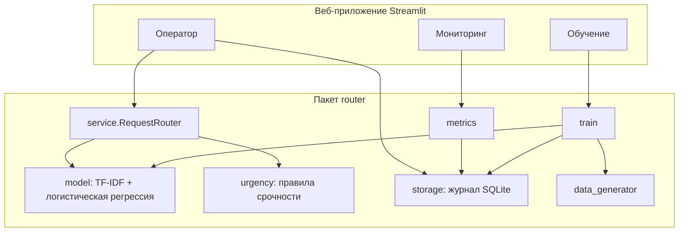

# Интеллектуальная маршрутизация обращений студентов

Учебный проект по производственной практике (технологической, проектно-технологической):
**кейс-задача № 3 «Интеграция искусственного интеллекта в бизнес-процессы»**,
адаптированная для Университета «Синергия».

Направление 09.03.03 «Прикладная информатика», профиль «Искусственный интеллект и большие данные».

## Что делает система

Студенты пишут в университет обращения в свободной форме. Система на основе
машинного обучения:

- определяет **отдел**, который должен ответить (8 отделов: деканат, учебный
  отдел, бухгалтерия, приёмная комиссия, IT-поддержка, справки и документы,
  практика и трудоустройство, студенческий офис);
- оценивает **уверенность**: при уверенности ниже 60 % обращение уходит на ручной
  разбор оператору;
- определяет **срочность**, и срочные обращения стоят первыми в очереди;
- ведёт **журнал** решений и исправлений операторов;
- **дообучается** на исправлениях операторов;
- показывает **мониторинг**: долю автоматизации, точность, сэкономленное время, нагрузку по отделам.

## Как проект закрывает этапы задания

| Этап задания | Где в проекте |
|---|---|
| 1. Анализ бизнес-процессов и выбор процессов для ИИ | [`docs/business_process.md`](docs/business_process.md) |
| 2. Выбор технологий ИИ | [`docs/technology_choice.md`](docs/technology_choice.md) |
| 3. Разработка и внедрение решения | пакет `router/` (модель, сервис, журнал) и приложение `app/` |
| 4. Обучение сотрудников | страница «Обучение» в приложении и [`docs/user_guide.md`](docs/user_guide.md) |
| 5. Мониторинг и анализ результатов | страница «Мониторинг» и [`docs/results.md`](docs/results.md) |

## Результаты (синтетические данные)

| Показатель | Значение |
|---|---|
| Macro-F1 модели на тестовой выборке | **0.960** |
| Доля автоматической маршрутизации (имитация 30 дней) | **90.2 %** |
| Точность маршрутизации по журналу | **92.2 %** |
| Сэкономлено времени сотрудников на 296 обращениях | **22.2 ч** |
| Время обработки одного обращения | ≈ 1.7 мс на CPU |

Подробный разбор результатов и ограничений: [`docs/results.md`](docs/results.md).

> ⚠️ Реальных обращений студентов в распоряжении не было. Датасет сгенерирован по
> шаблонам (`router/data_generator.py`), и цифры показывают работоспособность подхода,
> а не точность на реальном потоке.

## Быстрый старт

Нужен Python 3.10+. Если при загрузке готовой модели появится ошибка версии scikit-learn,
просто переобучите её командой `python -m router.train`.

```bash
python -m venv .venv
source .venv/bin/activate          # Windows: .venv\Scripts\activate
pip install -r requirements.txt

python -m router.train             # обучить модель (готовая модель уже лежит в models/)
python -m router.simulate --reset  # очистить журнал и заполнить демо-потоком за 30 дней
streamlit run app/main.py          # открыть приложение: http://localhost:8501

pytest                             # запустить тесты
```

Дообучение на исправлениях операторов: кнопка на странице «Обучение» или
`python -m router.train --with-corrections`.

## Архитектура



## Структура проекта

```
router/
  config.py          настройки: отделы, пути, порог уверенности
  preprocessing.py   нормализация текста
  data_generator.py  генератор синтетических обращений
  urgency.py         правила срочности
  model.py           обучение, оценка, сохранение модели
  service.py         маршрутизация: отдел + уверенность + срочность
  storage.py         журнал обращений (SQLite)
  metrics.py         метрики мониторинга
  train.py           CLI обучения
  simulate.py        CLI имитации потока обращений
app/
  main.py            точка входа Streamlit
  views/             страницы «Оператор», «Мониторинг», «Обучение»
data/dataset.csv     синтетический датасет
models/              обученная модель и отчёт о качестве
docs/                документация по этапам внедрения
tests/               автоматические тесты (pytest)
```
