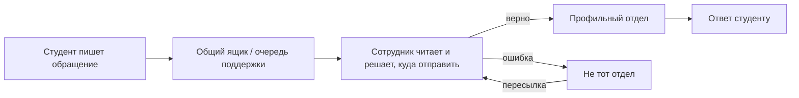
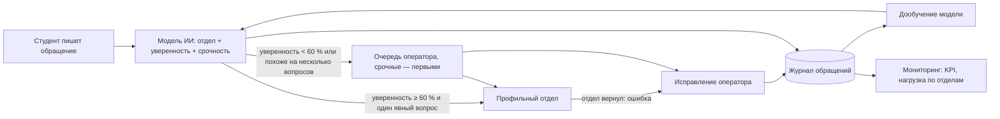

# Этап 1. Анализ бизнес-процессов

## Контекст

Университет «Синергия» — крупный частный вуз с большой долей студентов заочной
и онлайн-форм обучения. Такие студенты почти не приходят в университет лично:
вопросы по учёбе, оплате, документам и технике они задают письменно — через
личный кабинет, электронную почту, чат поддержки и мессенджеры.

Каждое обращение нужно прочитать, понять, какой отдел за него отвечает, и
переслать туда. При большом потоке обращений эта сортировка становится
отдельной трудоёмкой работой.

## Процессы-кандидаты на внедрение ИИ

| Процесс | Как ИИ может помочь | Эффект | Сложность внедрения | Нужные данные |
|---|---|---|---|---|
| **Маршрутизация обращений студентов** | Автоматически определять отдел и срочность | Высокий: массовый рутинный процесс | Низкая | Тексты обращений + отдел |
| Прогноз риска отчисления | Выявлять студентов с падающей активностью | Высокий | Средняя | Оценки, посещаемость, активность в LMS, оплаты |
| Чат-бот по частым вопросам | Отвечать на типовые вопросы без сотрудника | Средний | Средняя/высокая (LLM, база знаний) | Регламенты, FAQ |
| Проверка работ на заимствования | Уже решается внешними системами | Низкий (есть решения) | — | — |
| Прогноз нагрузки на отделы | Планировать штат в сессию/приёмную кампанию | Средний | Низкая | История обращений |

**Выбор для первого внедрения — маршрутизация обращений.** Процесс массовый
и повторяющийся, результат легко измерить (доля автоматической обработки,
точность, время), данные для обучения — это сами обращения, которые у
университета уже есть. Кроме того, журнал маршрутизации даёт данные для
следующего кандидата — прогноза нагрузки на отделы.

## Процесс «как было»

Узкие места:
- **Ручная сортировка.** Сотрудник тратит несколько минут на каждое обращение
  только на то, чтобы понять, кому его передать.
- **Пересылки по цепочке.** Ошибочно направленное обращение возвращается и
  ждёт повторной сортировки — ответ студенту задерживается.
- **Срочные вопросы теряются в общем потоке** («завтра экзамен, а тест не открывается»).
- **Нет статистики.** Непонятно, какой отдел перегружен и какие вопросы задают чаще всего.

## Процесс «как стало»

Что меняется:
- Типовые обращения уходят в отдел сразу, без участия сотрудника.
- Сотрудник разбирает только неоднозначные случаи, срочные — первыми.
- Каждое исправление сотрудника становится обучающим примером — модель со временем ошибается реже.
- Руководство видит нагрузку и качество работы системы на дашборде.

## Показатели (KPI) внедрения

| KPI | Как считается | Где смотреть |
|---|---|---|
| Доля автоматической маршрутизации | авто-обращения / все обращения | «Мониторинг» |
| Точность автомаршрутизации | 1 − доля исправленных среди направленных автоматически | «Мониторинг» |
| Точность модели | 1 − доля исправленных среди всех обработанных | «Мониторинг» |
| Сэкономленное время сотрудников | авто-обращения × 5 мин | «Мониторинг» |
| Размер очереди ручного разбора | необработанные обращения | «Оператор», «Мониторинг» |
| Качество модели на тесте | accuracy, macro-F1, матрица ошибок | «Мониторинг», `models/report.json` |
